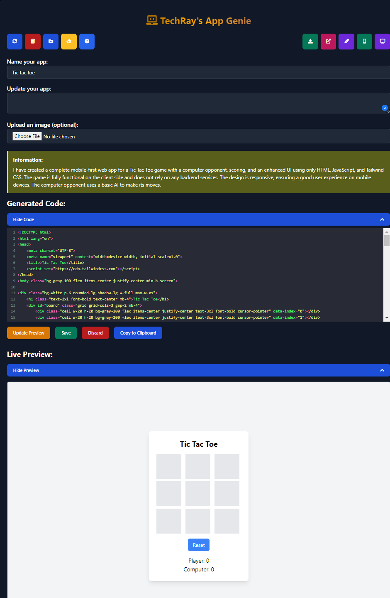

# App Genie

## Project Description

App Genie is a ChatGPT front end designed for HTML, JavaScript, and CSS developers. It offers an interactive interface to enhance the development experience.

## Features

- User-friendly interface
- Interactive help section
- Customizable favicon support
- Detailed project documentation

## Installation

To get a local copy up and running, follow these steps:

1. **Clone the repository**
    ```sh
    git clone https://github.com/techcow2/app-genie.git
    ```
2. **Navigate to the project directory**
    ```sh
    cd app-genie
    ```

## Usage

Open `index.html` in your preferred web browser to start using the application. The main interface is intuitive and provides easy navigation to all features.

### Running the Application

To view the application locally, open the `index.html` file in your browser.

### Help

Detailed help documentation is available in the `help` directory. Open `help/index.html` for more information.

## Contributing

Contributions are what make the open source community such an amazing place to learn, inspire, and create. Any contributions you make are **greatly appreciated**.

1. Fork the Project
2. Create your Feature Branch (`git checkout -b feature/AmazingFeature`)
3. Commit your Changes (`git commit -m 'Add some AmazingFeature'`)
4. Push to the Branch (`git push origin feature/AmazingFeature`)
5. Open a Pull Request

## License

Distributed under the MIT License. See `LICENSE` for more information.

## Screenshots




## Credits

- Inspired by https://picoapps.xyz
